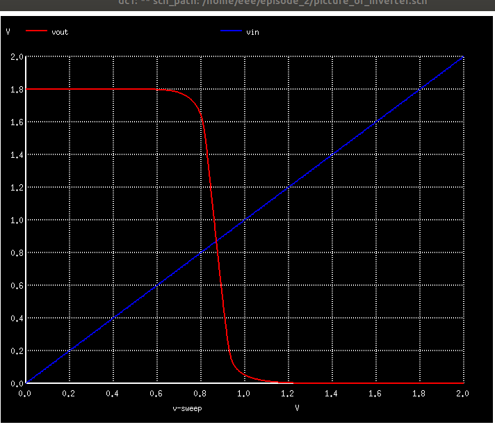

# Design_Analysis_of_Inverter_using_skypdk130_xschem

The main motive of this project is to understand the working of an inverter and understand the parameters that are involved in the inverter. 

The design of inverter is done by utilizing the models that are present under the **skywater 130nm pdk** and  various kinds of open source tools. They are **Xschem**, **NGSPICE** etc.

## Contents

-  TOOLS USED
- CMOS Inverter

## Tools Used
VLSI (Very Large Scale Integration) open source EDA (Electronic Design Automation) tools are software programs that aid in the design and creation of electronic circuits and systems. These tools are open source, meaning that they are freely accessible and modifiable by anyone. 

- **NGSPICE** 
 Ngspice is the open source **spice** simulator for electric and electronic circuits.It is a simulation tool used to create and simulate circuit designs.  Ngspice is an open project, there is no closed group of developers.It allows users to test circuits before they are physically constructed, saving time and money in the design process. 

 [NG_spice documentation](https://ngspice.sourceforge.io/docs/ngspice-manual.pdf)

 - **Xschem**
 Xschem is a schematic capture program that allows to interactively enter an electronic circuit using a graphical and easy to use interface. When the schematic has been created a circuit netlist can be generated for simulation.

For more details : 
 [Xschem tutorial](https://xschem.sourceforge.io/stefan/xschem_man/xschem_man.html)

- **PDK**
A process design kit (PDK) is a set of files used within the semiconductor industry to model a fabrication process for the design tools used to design an integrated circuit. The PDK is created by the foundry defining a certain technology variation for their processes. It is then passed to their customers to use in the design process.

The PDK we are going to use for this project is Google Skywater-130 (130 nm) PDK. 

For further details : [Skywater PDK 130](https://skywater-pdk.readthedocs.io/en/main/)

**More details on how to install these tools**

Go to this Github File: [Github](https://github.com/rajdeep66/edaBundle_whyRD)

See this video: [video link](https://www.youtube.com/watch?v=VCuyO7Chvc8&list=PL0E9jhuDlj9r-XIIgx5PPJpogx7ThS5CB&index=2)

## CMOS- Inverter

CMOS Circuits generally consists of a network split into two parts, Upper one referred to as a pull up network and the lower half as a pull down network. The former consists of P-channel MOSFETs and later N-Channel MOSFETs. Reason is simple. As one transistor is one, another is off. This eliminates the issue of an resistive path to the ground and hence, no voltage division occurs(At least not a significant one). This way, one can easily achieve a Strong High and a Strong LOW from the same network. PULL UP is what offers a low resistance path to the VDD and PULL DOWN is what offers a low resistance path the GND.

The Schematic layout for the inverter design using skywater pdk 130 models in Xschem is shown below :

The width of MOSFET :NML(Noise Margin for Low) - VIL - VOL
NMH(Noise Margin for HIGH) - VOH - VIH

So for our calculated values, the device would have, NML = 0.74V and NML = 0.82V.

    PMOS  = 2
    NMOS = 1

    
This Schematic layout is transformed into symbol. Ths symbol of NOT GATE is shown below : 

 shift .
The complete inverter Representation is shown below:

Check whether there is error or not using NETLIST tool

Next After that Clisck on Simulation Tool

The simulated Vout Vin graph  done using NGSPICE is shown below: 

 

The Image shown above can be ploted by just typing :

    plot vout vin NML(Noise Margin for Low) - VIL - VOL
NMH(Noise Margin for HIGH) - VOH - VIH

So for our calculated values, the device would have, NML = 0.74V and NML = 0.82V.
in the simulation window.

 

The command needed to type in the simulation window of xterm terminal to get gain, can be seen in the images.

 shift .

The values Obatined finally is shown below:

    Variable      Values   
    VoH            1.8
    VoL            0
    ViL            0.74
    ViH            0.98
    

NML(Noise Margin for Low) - VIL - VOL
NMH(Noise Margin for HIGH) - VOH - VIH

So for our calculated values, the device would have, NML = 0.74V and NML = 0.82V.

The propogation delay for the First Fall of Output and First Rise of Input is shown below:

